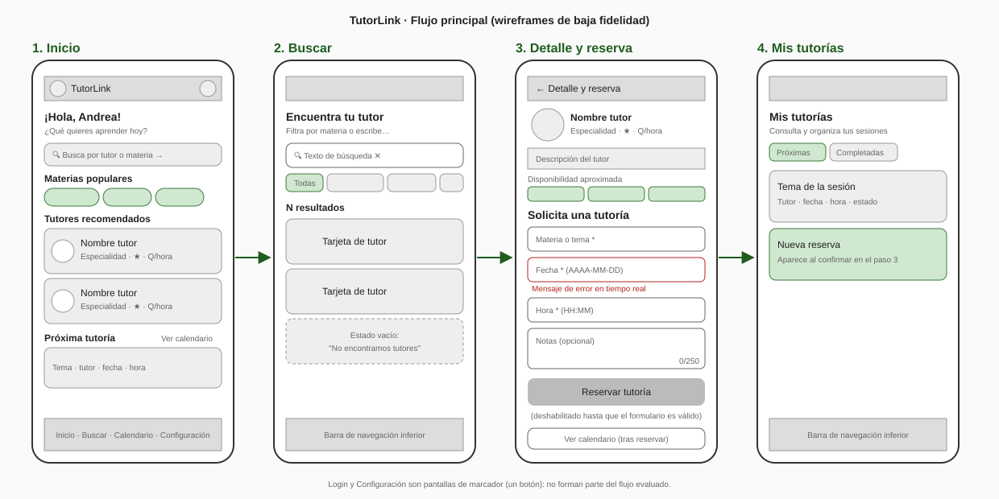
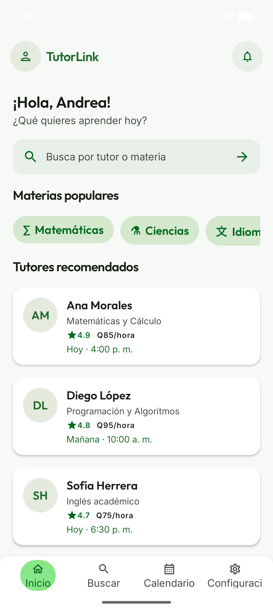
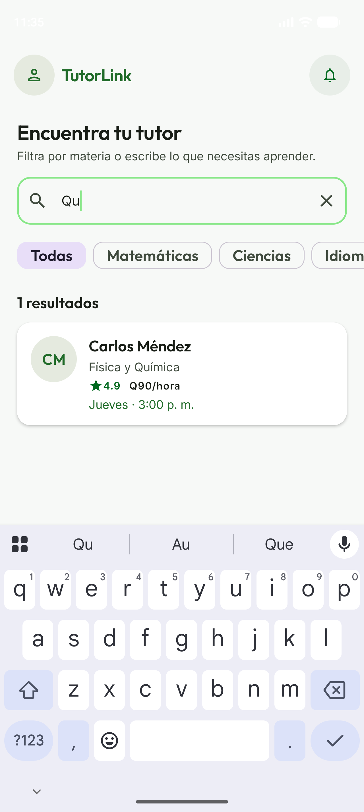
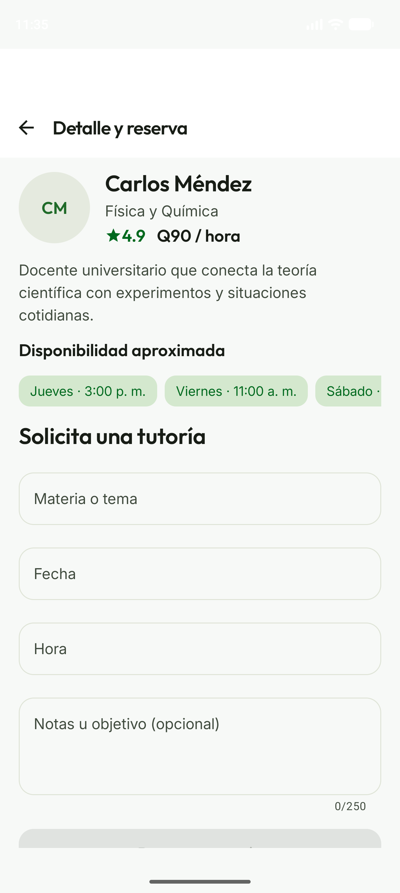
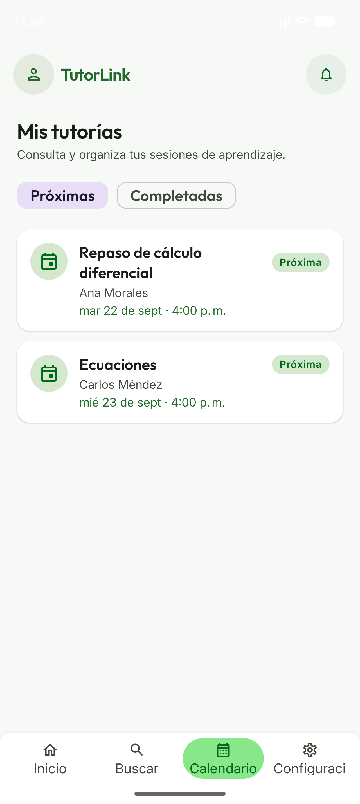

# Informe final · Testeo de TutorLink

| | |
|---|---|
| **Proyecto** | TutorLink – App de tutorías (Jetpack Compose + Material 3) |
| **Repositorio** | https://github.com/Lester-Rodrigo/Proyecto_App_Tutorias |
| **Rama evaluada** | [`pantallas-mock`](https://github.com/Lester-Rodrigo/Proyecto_App_Tutorias/tree/pantallas-mock) (commit `676f289`) |
| **PR del proyecto Android** | [#2](https://github.com/Lester-Rodrigo/Proyecto_App_Tutorias/pull/2) |
| **PR de este informe** | [#1](https://github.com/Lester-Rodrigo/Proyecto_App_Tutorias/pull/1) |
| **Fecha** | 20 de septiembre de 2026 |
| **Responsable** | Persona 3 – Testeo y reporte |

---

## Cumplimiento de la Entrega 3

| Evidencia solicitada | Dónde está | Estado |
|---|---|---|
| Wireframes usados para validar con el cliente antes de codificar | [Sección 3](#3-wireframes): enlace al prototipo Figma/Stitch del Hito de semana 8 | ⏳ Pendiente: enlace del equipo que hizo el prototipo |
| Proyecto Android con 3–4 pantallas, Navigation Compose y Material 3 (**enlace al PR**) | Rama `pantallas-mock`: Inicio, Buscar, Detalle y reserva, Mis tutorías (+ Login y Configuración) | ✔ [PR #2](https://github.com/Lester-Rodrigo/Proyecto_App_Tutorias/pull/2) |
| Datos mock visibles en las pantallas | `data/MockData.kt`: 4 categorías, 4 tutores y 2 sesiones; ver [capturas](#3-wireframes) | ✔ |
| Formulario con mínimo 3 campos, validación en tiempo real y botón condicionado | *Solicita una tutoría*: tema, fecha, hora y notas; ver [sección 4.1](#1-el-formulario-valida-en-tiempo-real-y-da-buena-respuesta) | ✔ (con el problema del campo Hora, sección 5.1) |
| Registro de Testear: 3 cosas que funcionan y 3 que confunden | [Secciones 4 y 5](#4-tres-cosas-que-funcionan-) y [sección 6](#6-resultados-por-participante) | ✔ Evaluación interna y recorrido cognitivo; ⏳ sesión con cliente/usuarios pendiente |
| Instrucciones documentadas | [Sección 8](#8-documentación-de-instrucciones) y [guion](guion-sesion-testeo.md#6-instrucciones-para-correr-la-app) | ✔ |
| Cita del uso de inteligencia artificial | [Sección 9](#9-uso-de-inteligencia-artificial) | ✔ |

## 1. Resumen

Se evaluó el flujo principal **Inicio → Buscar → Detalle y reserva → Mis tutorías** en un emulador
Pixel 10 Pro (Android). El flujo está completo: los datos mock se cargan en todas las pantallas y la
reserva confirmada aparece en el calendario.

El problema más grave está en el formulario de reserva. El campo **Hora** abre un teclado numérico
que **no tiene la tecla ":"**, así que un usuario no puede escribir `16:00` y el botón *Reservar tutoría*
nunca se habilita. Mientras no se corrija, un usuario real no puede terminar el flujo. Es la corrección
de mayor prioridad para la Persona 2 (ver [sección 7](#7-prioridad-de-correcciones)).

## 2. Metodología

1. **Verificación técnica:** `./gradlew testDebugUnitTest assembleDebug` → **BUILD SUCCESSFUL**,
   7/7 pruebas unitarias aprobadas (`BookingValidationTest`: 4, `TutorFilterTest`: 3).
2. **Recorrido guiado en el emulador:** se ejecutaron las tareas T1–T6 del
   [guion de testeo](guion-sesion-testeo.md) y se capturó cada pantalla (carpeta [`capturas/`](capturas)).
3. **Sesión con usuarios:** planeada con 4 estudiantes y 2 tutores, con el mismo guion y la hoja de
   observación. **Todavía no se realiza.** Los hallazgos de este informe vienen de la evaluación interna
   del equipo (puntos 1 y 2) y de un recorrido cognitivo con perfiles simulados. Ver la [sección 6](#6-resultados-por-participante).

## 3. Wireframes

**Prototipo validado con el cliente (Hito de semana 8):** *agregar aquí el enlace al prototipo Figma/Stitch.*

Diagrama del flujo implementado en baja fidelidad ([`wireframes/flujo-principal.svg`](wireframes/flujo-principal.svg)).
Se elaboró **después** de codificar, a partir de las pantallas de la rama `pantallas-mock`, para guiar
la sesión de testeo. No reemplaza a los wireframes validados antes de codificar.



Pantallas implementadas (capturas del emulador):

| Inicio | Buscar | Detalle y reserva | Mis tutorías |
|---|---|---|---|
|  |  |  |  |

## 4. Tres cosas que funcionan ✅

### 1. El formulario valida en tiempo real y da buena respuesta
Cada campo muestra un mensaje de error concreto mientras se escribe (por ejemplo, *"Escribe al menos
3 caracteres."* o *"Usa una hora válida con formato HH:MM."*). El botón *Reservar tutoría* queda
deshabilitado hasta que todo es válido, muestra un indicador de carga al enviar y termina con el
mensaje *"¡Reserva confirmada!"*. El botón cambia a *Tutoría reservada*, así que no se puede reservar dos veces.
*Evidencia:* [06-error-tema](capturas/06-error-tema.png), [09-reserva-confirmada](capturas/09-reserva-confirmada.png).

### 2. La reserva queda guardada y se ve en el calendario
Al confirmar, la sesión aparece de inmediato en **Mis tutorías › Próximas**, junto a la sesión mock
existente y ordenada por fecha. La pestaña *Completadas* separa el historial.
*Evidencia:* [10-calendario](capturas/10-calendario.png).

### 3. Buscar filtra al instante y maneja el caso sin resultados
La búsqueda filtra por nombre o especialidad mientras se escribe. Se puede combinar con los filtros
por materia y muestra un contador de resultados. Si no hay coincidencias, aparece un estado vacío
claro (*"No encontramos tutores"*). La barra inferior marca bien la pantalla activa.
*Evidencia:* [04-buscar-resultados](capturas/04-buscar-resultados.png).

## 5. Tres cosas que confunden ⚠️

### 1. No se puede escribir la hora (bloqueante) y la fecha es manual
Los campos **Fecha** y **Hora** usan `KeyboardType.Number`. Ese teclado trae "-" pero **no ":"**,
así que con el teclado del teléfono es imposible escribir `HH:MM` y no se puede reservar. Además, hay
que escribir la fecha a mano con formato `AAAA-MM-DD`, que no es natural para el usuario.
*Evidencia:* [07-teclado-fecha](capturas/07-teclado-fecha.png).
**Propuesta:** usar `DatePickerDialog` y `TimePickerDialog` (o el `DatePicker`/`TimePicker` de Material 3), o
por lo menos `KeyboardType.Text` para la hora. Código: `ui/screens/TutorDetailScreen.kt:175` y `:188`.

### 2. Elementos que parecen tocables pero no hacen lo esperado
- Los chips de **Disponibilidad aproximada** (*Jueves · 3:00 p. m.*, etc.) parecen horarios para
  elegir, pero al tocarlos no pasa nada y no llenan el formulario (`TutorDetailScreen.kt:131`).
- En Inicio, las **Materias populares** abren Buscar **sin aplicar el filtro**: al tocar *Matemáticas*
  aparecen todos los tutores (`HomeScreen.kt:107`). *Evidencia:* [03-buscar-desde-categoria](capturas/03-buscar-desde-categoria.png).
- La **campana de notificaciones** no hace nada (`navigation/NavHost.kt:55`), y el ícono de **perfil**
  lleva a Configuración.

**Propuesta:** hacer que el chip de horario llene la fecha y la hora, pasar la categoría como argumento
de ruta a Buscar y ocultar la campana hasta que tenga una función.

### 3. La búsqueda exige tildes, y hay detalles de texto y diseño
- Buscar **"Fisica"** (sin tilde) da *0 resultados*; solo funciona "Física". La mayoría de usuarios
  escribe en el celular sin tildes (`data/TutorFilter.kt:12-13`). **Propuesta:** normalizar los textos
  quitando acentos antes de comparar (`java.text.Normalizer`).
- El contador dice **"1 resultados"** (`res/values/strings.xml:18`). **Propuesta:** usar `plurals`.
- En la barra inferior, la etiqueta **"Configuración" se corta** ("Configuraci") y la píldora de
  *Inicio* no alcanza a cubrir su texto (`ui/components/BorromBar.kt`). *Evidencia:* [02-inicio](capturas/02-inicio.png).
- En **Detalle y reserva** hay una franja blanca vacía sobre el título, por un doble relleno de la barra
  de estado entre el `Scaffold` de `NavHost` y el de `TutorDetailScreen`.
- Después de reservar, el mensaje de confirmación **tapa el botón *Ver calendario*** durante unos
  segundos. *Evidencia:* [09-reserva-confirmada](capturas/09-reserva-confirmada.png).

## 6. Resultados por participante

### 6.1 Evaluación interna del equipo (realizada)

Recorrido de las tareas T1–T6 en el emulador. Lo realizó el equipo, no son usuarios finales.

| Tarea | Resultado | Observación |
|---|---|---|
| T1 · Explorar Inicio | ✔ Completada | Se entiende la búsqueda, los tutores recomendados y la próxima tutoría. Hay que desplazarse para ver *Próxima tutoría*. |
| T2 · Encontrar tutor de Física | ✔ Con tilde / ✘ Sin tilde | "Física" encuentra a Carlos Méndez; "Fisica" da 0 resultados. |
| T3 · Filtrar Idiomas | ✔ Completada | Desde Buscar funciona; desde *Materias populares* en Inicio no se aplica el filtro. |
| T4 · Reservar tutoría | ✘ Bloqueada | Sin la tecla ":" no se puede escribir la hora con el teclado. Solo se completó escribiendo la hora por fuera del teclado (adb). |
| T5 · Ver la reserva | ✔ Completada | Aparece en *Mis tutorías › Próximas*. El mensaje de confirmación tapa un momento el botón *Ver calendario*. |
| T6 · Ver tutorías pasadas | ✔ Completada | El filtro *Completadas* muestra la sesión mock. |

### 6.2 Sesión con usuarios (pendiente)

Participantes confirmados. La sesión se hará con el [guion](guion-sesion-testeo.md) y esta tabla se
llenará con sus resultados.

| Participante | Perfil | T1 | T2 | T3 | T4 | T5 | T6 | Facilidad (1–5) | Comentario principal |
|---|---|---|---|---|---|---|---|---|---|
| Javier Sanchez | Estudiante | | | | | | | | |
| Valeria Hernandez | Estudiante | | | | | | | | |
| Mauricio Corado | Estudiante | | | | | | | | |
| Valeria Velez | Estudiante | | | | | | | | |
| Pietro Ubico | Tutor | | | | | | | | |
| Anna Bran | Tutora | | | | | | | | |

A los tutores conviene agregarles una pregunta: *"¿La información de tu perfil (especialidad, precio,
disponibilidad) es la que un estudiante necesita para elegirte?"*

**Hipótesis para validar en la sesión:** en T2, los participantes que escriban "fisica" sin tilde no
encontrarán tutor; en T4, algunos tocarán los chips de disponibilidad esperando que llenen el formulario.
Observar también si los participantes intentan escribir la hora y en qué momento abandonan.

### 6.3 Recorrido cognitivo con perfiles simulados

> ⚠️ **Simulación.** Esta sección **no** contiene datos de personas reales. Es un *recorrido cognitivo*
> (*cognitive walkthrough*): el equipo recorre cada tarea en la app poniéndose en el lugar de perfiles
> ficticios y predice dónde tendrían éxito o dificultad. Las predicciones se basan en el comportamiento
> real de la app observado en el emulador (sección 6.1). Se deben confirmar con la sesión de la sección 6.2.

En cada paso se respondieron las cuatro preguntas del método:
**(1)** ¿El usuario intentará hacer lo correcto? **(2)** ¿Verá el control disponible?
**(3)** ¿Entenderá que ese control hace lo que busca? **(4)** ¿Entenderá la respuesta de la app?

#### Perfiles ficticios

| Perfil | Descripción | Rasgos relevantes |
|---|---|---|
| **A · Estudiante de secundaria** | 15 años, usa el celular todo el día, necesita ayuda en Física para un examen. | Escribe rápido y sin tildes; no lee instrucciones. |
| **B · Estudiante universitario** | 20 años, estudia Ingeniería, busca tutor de Programación. | Experto en apps; espera selectores de fecha y hora como en otras apps. |
| **C · Estudiante adulta que trabaja** | 35 años, retoma estudios, quiere practicar Inglés; usa el celular solo para lo básico. | Lee con cuidado; se frustra si un botón no responde. |
| **D · Tutor** | Docente que evalúa si la app muestra bien su perfil a los estudiantes. | Revisa la información de la tarjeta y del detalle. |

#### Resultados previstos por tarea

Leyenda: ✔ la completaría · ⚠ la completaría con dudas · ✘ no la completaría

| Tarea | A | B | C | D | Punto de fricción previsto |
|---|---|---|---|---|---|
| T1 · Explorar Inicio | ✔ | ✔ | ✔ | ✔ | Ninguno importante; *Próxima tutoría* queda abajo y requiere desplazarse. |
| T2 · Tutor de Física | ✘ | ✔ | ⚠ | — | A escribe "fisica" y obtiene 0 resultados (pregunta 4: interpreta que no hay tutores de Física). C prueba con el chip *Ciencias*. |
| T3 · Filtrar Idiomas | ⚠ | ✔ | ⚠ | — | A y C tocan *Idiomas* en Inicio y llegan a Buscar sin filtro aplicado (pregunta 4). |
| T4 · Reservar tutoría | ✘ | ✘ | ✘ | — | Ninguno puede escribir la hora: el teclado no tiene ":" (pregunta 2). B además espera un selector; C toca los chips de disponibilidad creyendo que eligen horario (pregunta 3). |
| T5 · Ver la reserva | ✘* | ✘* | ✘* | — | *No se puede hacer si T4 falla. Con la hora corregida sería ✔ para todos. |
| T6 · Tutorías pasadas | ✔ | ✔ | ✔ | — | El filtro *Completadas* es claro. |
| Perfil del tutor | — | — | — | ⚠ | D ve bien la especialidad, el precio y la calificación, pero la disponibilidad son textos fijos que no se pueden elegir. |

#### Conclusiones de la simulación

1. **La reserva (T4) es el cuello de botella para todos los perfiles.** Sin corregir el campo Hora, la
   sesión con usuarios reales terminará en T4 y no se podrán evaluar T5 ni la confirmación.
2. **Los usuarios que escriben sin tildes (perfil A) no encontrarán tutores**, aunque existan.
3. **Los perfiles con menos experiencia (C) confían en los chips** de materias y de disponibilidad, y
   ambos no hacen lo que prometen visualmente.
4. **Lo que sí funciona para todos:** la navegación inferior, la validación del formulario con mensajes
   claros y el filtro de *Completadas*.

Estas conclusiones coinciden con los hallazgos de las secciones 4 y 5 y refuerzan la prioridad de la sección 7.

## 7. Prioridad de correcciones

| Prioridad | Corrección | Archivo |
|---|---|---|
| 🔴 Alta | Selector de fecha y hora (o teclado que permita ":"), bloquea la reserva | `ui/screens/TutorDetailScreen.kt` |
| 🟠 Media | Búsqueda sin distinguir tildes | `data/TutorFilter.kt` |
| 🟠 Media | Categoría de Inicio aplica el filtro en Buscar | `ui/screens/HomeScreen.kt`, `navigation/NavHost.kt` |
| 🟠 Media | Chips de disponibilidad llenan el formulario | `ui/screens/TutorDetailScreen.kt` |
| 🟡 Baja | Etiqueta cortada en la barra inferior, franja blanca, "1 resultados", snackbar sobre el botón | `BorromBar.kt`, `TutorDetailScreen.kt`, `strings.xml` |

## 8. Documentación de instrucciones

Los pasos para clonar, compilar, correr las pruebas e instalar la app están en
[guion-sesion-testeo.md › Instrucciones](guion-sesion-testeo.md#6-instrucciones-para-correr-la-app).

Estructura del proyecto:

```
app/src/main/java/com/example/app_tutorias/
├── MainActivity.kt           # Punto de entrada: TutorLinkTheme + TutorLinkNavHost
├── navigation/               # Destination (rutas) y NavHost
├── data/                     # Modelos, MockData, validación del formulario y filtro de tutores
└── ui/
    ├── TutorLinkViewModel.kt # Estado de sesiones (StateFlow)
    ├── components/           # TopBar, BottomBar, tarjetas
    ├── screens/              # Login, Home, Search, TutorDetail, Calendar, Settings
    └── theme/                # Colores, tipografía y formas (Material 3)
```

Contenido de esta carpeta:

| Archivo | Descripción |
|---|---|
| `informe-final.md` | Este informe |
| `guion-sesion-testeo.md` | Guion, tareas, hoja de observación e instrucciones |
| `wireframes/flujo-principal.svg` | Diagrama del flujo implementado |
| `capturas/` | 11 capturas del recorrido en el emulador |

## 9. Uso de inteligencia artificial

Este informe se elaboró con apoyo de **Claude** (Anthropic, modelo Claude Opus 5, mediante la aplicación
Claude Code), el 20 de septiembre de 2026. La IA:

- Compiló el proyecto y ejecutó las pruebas unitarias (`./gradlew testDebugUnitTest assembleDebug`).
- Recorrió el flujo en el emulador, tomó las capturas y detectó los hallazgos de las secciones 4 y 5.
- Redactó el borrador de este informe y del guion de testeo.
- Elaboró el diagrama del flujo (`wireframes/flujo-principal.svg`).
- Elaboró el recorrido cognitivo con perfiles simulados (sección 6.3).
- Abrió los pull requests #1 (informe) y #2 (proyecto Android).

El equipo confirmó en la app el problema del campo Hora. Antes de entregar, cada integrante debe revisar
el contenido y poder explicarlo en la defensa técnica.
La IA no modificó el código de la app.

